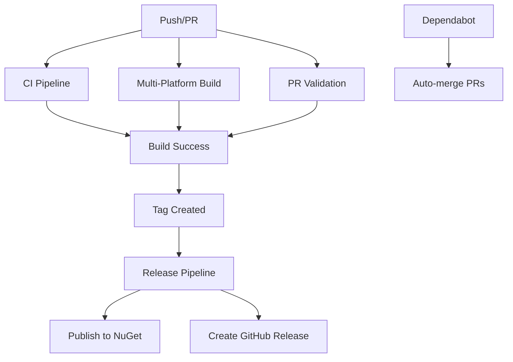

# GitHub Actions Workflows

This directory contains GitHub Actions workflows for the HobScript project.

## Workflows Overview

### 🔄 **Continuous Integration**
- **File**: `ci.yml`
- **Triggers**: Push to master/main/develop, Pull requests
- **Purpose**: Build, test, and validate code quality
- **Features**:
  - Multi-framework builds (.NET 6.0, .NET Framework 4.8)
  - Code quality checks
  - Security scanning
  - Documentation validation
  - Package installation testing

### 🏗️ **Build and Publish**
- **File**: `build-and-publish.yml`
- **Triggers**: Push to master/main, Tags, Manual dispatch
- **Purpose**: Build library and create NuGet packages
- **Features**:
  - Multi-platform builds
  - NuGet package creation
  - Publishing to NuGet.org
  - Publishing to GitHub Packages

### 🌍 **Multi-Platform Build**
- **File**: `multi-platform-build.yml`
- **Triggers**: Push to master/main/develop, Pull requests
- **Purpose**: Test compatibility across different operating systems
- **Features**:
  - Windows, Linux, macOS builds
  - .NET Framework compatibility testing
  - Cross-platform validation

### ✅ **Pull Request Validation**
- **File**: `pr-validation.yml`
- **Triggers**: Pull requests to master/main/develop
- **Purpose**: Validate pull requests before merging
- **Features**:
  - Build validation
  - Code analysis
  - Package creation testing
  - Installation testing

### 🚀 **Release Management**
- **File**: `release.yml`
- **Triggers**: Git tags (v*), Manual dispatch
- **Purpose**: Create releases and publish packages
- **Features**:
  - Automated version updates
  - GitHub release creation
  - NuGet package publishing
  - Release notes generation

### 🔄 **Dependency Updates**
- **File**: `dependabot.yml`
- **Triggers**: Dependabot pull requests
- **Purpose**: Automatically merge dependency updates
- **Features**:
  - Auto-merge patch updates
  - Dependency monitoring

## Workflow Dependencies



## Required Secrets

To enable full functionality, configure these secrets in your GitHub repository:

### NuGet Publishing
- `NUGET_API_KEY`: Your NuGet.org API key for publishing packages

### GitHub Packages
- `GITHUB_TOKEN`: Automatically provided by GitHub Actions

## Workflow Status

| Workflow | Status | Description |
|----------|--------|-------------|
| CI | ✅ Active | Continuous integration and quality checks |
| Build & Publish | ✅ Active | Build and publish NuGet packages |
| Multi-Platform | ✅ Active | Cross-platform compatibility testing |
| PR Validation | ✅ Active | Pull request validation |
| Release | ✅ Active | Automated release management |
| Dependabot | ✅ Active | Dependency update automation |

## Local Development

### Using PowerShell Build Script
```powershell
# Build in Release mode
.\build.ps1

# Clean and build with packages
.\build.ps1 -Clean -Pack

# Build with custom version
.\build.ps1 -Version "1.1.0" -Pack

# Run tests
.\build.ps1 -Test
```

### Using .NET CLI
```bash
# Restore dependencies
dotnet restore

# Build library
dotnet build HobScript.csproj --configuration Release

# Create NuGet package
dotnet pack HobScript.csproj --configuration Release --output nupkgs

# Run console application
dotnet run --project HobScript.Console.csproj
```

## Workflow Triggers

### Automatic Triggers
- **Push to master/main**: Runs CI, Build & Publish, Multi-Platform
- **Push to develop**: Runs CI, Multi-Platform
- **Pull Request**: Runs CI, Multi-Platform, PR Validation
- **Git Tag (v*)**: Runs Release pipeline
- **Dependabot PR**: Runs Dependabot auto-merge

### Manual Triggers
- **Workflow Dispatch**: All workflows can be triggered manually
- **Release Creation**: Can be triggered with custom version

## Monitoring and Notifications

- **Build Status**: Visible in pull requests and commits
- **Release Status**: Checked in Actions tab
- **Package Status**: Monitored via NuGet.org and GitHub Packages
- **Dependency Updates**: Automated via Dependabot

## Troubleshooting

### Common Issues
1. **Build Failures**: Check the Actions tab for detailed logs
2. **Package Publishing**: Verify NuGet API key is configured
3. **Version Conflicts**: Ensure version numbers are properly updated
4. **Dependency Issues**: Check Dependabot configuration

### Getting Help
- Check the [main documentation](../README.md)
- Review [API documentation](../API_DOCUMENTATION.md)
- Open an [issue](../../issues) for workflow problems
- Check [examples](../EXAMPLES.md) for usage patterns
